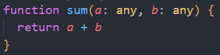

# AOP Coding Test

## QnA Umum

### 1. Bagaimana cara handling response error jika mendapatkan error sebagai berikut, "InternalServerError: Please check log for detailed error"

> Tergantung dimana error ini ingin di handle. jika di front end bisa tampilkan message general `terjadi kesalahan pada server` etc. jika di backend perlu dilihat lagi dimana log disimpan dan mesti menganalisa mengapa error terjadi

### 2. Apakah penggunaan console.log pada di production diperbolehkan dan jelaskan alasannya

> Depends case by case lagi. jika hanya untuk logging dimana dan apa yang berjalan saya rasa masih aman selama tidak memunculkan data / credential

### 3. Buatlah Database Mini E-commerce dengan PostgreSQL

#### a. Schema

> 

```
Table Customers {
  id serial [pk, not null]
  name text [not null]
  email varchar(255) [not null, unique]
  created_at timestamp [not null, default: "NOW()"]
  updated_at timestamp [not null, default: "NOW()"]
}

Table Products {
  id serial [pk, not null]
  owner_id int [not null, ref: > Customers.id]
  name text [not null]
  price int [not null]
  qty int [not null]
  active boolean [not null, default: false]
  created_at timestamp [not null, default: "NOW()"]
  updated_at timestamp [not null, default: "NOW()"]
}

Table Orders {
  id serial [pk, not null]
  cust_id int [not null, ref: > Customers.id]
  status varchar(32) [not null, default: "progress"]
  created_at timestamp [not null, default: "NOW()"]
  updated_at timestamp [not null, default: "NOW()"]
}

Table OrderItems {
  id serial [pk, not null]
  product_id int [not null, ref: > Products.id]
  order_id int [not null, ref: > Orders.id]
  qty int [not null]
  created_at timestamp [not null, default: "NOW()"]
  updated_at timestamp [not null, default: "NOW()"]
}
```

#### b. Query

-  Menampilkan semua produk

```
SELECT * FROM Products p
WHERE p."active" = true
```

-  Menampilkan semua order beserta detail pelanggan dan item-item yang dibeli

```
SELECT
  o.*,
  c."id" as "cust_id",
  c."name" as "cust_name",
  oi."qty" as "order_qty",
  p."id" as "product_id",
  p."name" as "product_name"
FROM Orders o
LEFT JOIN Customers c ON c."id" = o."cust_id"
LEFT JOIN OrderItems oi ON oi."order_id" = o."id"
LEFT JOIN Products p ON p."id" = oi."product_id"
WHERE o."status" = 'success'
```

-  Menampilkan total penjualan per pelanggan

```
SELECT
  c."id" as "cust_id",
  c."name" as "cust_name",
  SUM(oi."qty" * p."price") as "total_order"
FROM Customers c
LEFT JOIN Orders o ON o."cust_id" = c."id"
LEFT JOIN OrderItems oi ON oi."order_id" = o."id"
LEFT JOIN Products p ON p."id" = oi."product_id"
WHERE o."status" = 'success'
GROUP BY c."id", c."name"
```

-  Menampilkan produk yang paling laris (berdasarkan jumlah terjual).

```
SELECT
  p."id",
  p."name",
  SUM(oi."qty") as "total_selling"
FROM Products p
LEFT JOIN OrderItems oi ON oi."product_id" = p."id"
LEFT JOIN Orders o ON oi."order_id" = o."id" AND o."status" = 'success'
WHERE o."status" = 'success'
GROUP BY p."id", p."name"
ORDER BY "total_selling" DESC
```

### 4. Buatkan mini project CRUD dengan menggunakan React sebagai FrontEnd dan NodeJS koa framework typescript sebagai BackEnd dan Postgresql sebagai Databasenya.

> Check folder koa-react

### 5. Apakah code typescript di bawah sudah baik dan benar dalam penulisannya?

> 

> belum, karena param a dan b mungkin tidak bisa ditambahkan, tidak ada atau hasil yang didapat tidak sesuai dengan expected return dari fungsi `sum`

### 6. Dalam kasus apa State Management Global di React bagus digunakan dan dalam kasus apa State Management Global di React tidak bagus digunakan ?

> Dalam project skala besar dimana banyak terdapat layer dan higher order component sehingga passing data menggunakan useContext tidak lagi viable

### 7. Apakah pengguna useEffect dibawah sudah baik dan benar

> 

> belum benar, karena tidak ada cleanup dari event yang di listen. sehingga akan terus bertambah jika useEffect ke trigger

### 8. Gambar dibawah adalah sebuah API sederhana untuk checkout yang akan digunakan di Frontend, apakah logic dari API yang dibuah sudah benar ?

> 

> Belum sepenuhnya karena perlu diadakan validasi sebelum membuat order. seperti check keberadaan item dan check quantity nya

```

```
